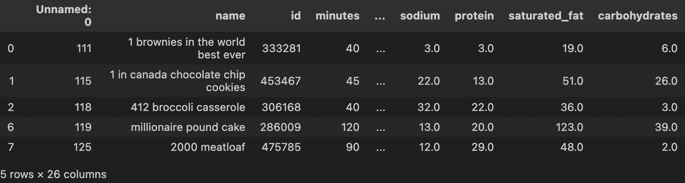

# Recipe Analysis Final Project
Name: Ankita Inamti 

## Introduction
In this project I will be analyzing two dataframes: recipes and interactions. Recipes contains 83782 rows and a few relevant columns include the recipe name and id, nutrition information, the number of steps in the recipe, the text for recipe steps, and the user provided description. Interactions contains 731927 rows and the columns include the user and recipe id, date of interaction, and the rating and review of the recipe. 
  
After looking at the information given in the two datasets, I will be performing analyzing the healthiness of the recipes given based on the nutrition information given in the recipes dataframe. In order to evaluate the healthiness of a recipe, I will look for recipes with a low amount of carbohydrates and high amounts of protein. My analysis will include a implementing a hypothesis test to see if recipes with meat are healthier than recipes without meat and a regression model to predict the number of calories in a recipe. 

## Data Cleaning and Exploratory Data Analysis
I left merged the recipe and interactions dataframes and filled the rating column with NaN becuase there are multiple ratings for the same recipe in the interactions dataset. In order to get one rating value for each recipe in the merged dataframe, I found the average rating for each recipe and created a new column named average_rating in the recipe_interact dataframe to store all the values. 

In order to analyze the nutritional information, I first created a helper function which converts a string into a list, since the nutrition column was formatted as a list but was of a string type. After changing the nutrition column's type, I created separate columns for each nutritional value (calories (#), total fat (PDV), sugar (PDV), sodium (PDV), protein (PDV), saturated fat (PDV), and carbohydrates (PDV)). I then dropped any duplicate values that may have existed in the current dataframe. 

```py
recipe_interact.head()
```



## Assessment of Missingness


## Hypothesis Testing


## Framing a Prediction Problem


## Baseline Model


## Final Model

## Fairness Analysis


